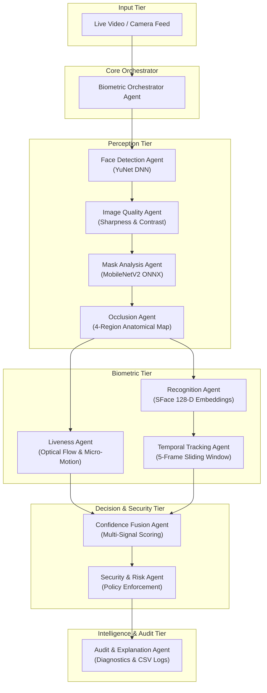

<div align="center">

# 🎭 MFR-X — Multi-Agent Real-Time Masked Face Recognition

**An intelligent, CPU-optimized computer vision & biometric verification framework driven by a cooperative multi-agent AI architecture.**

[](https://www.python.org/)
[](https://opencv.org/)
[](https://onnxruntime.ai/)
[](https://flask.palletsprojects.com/)
[](#system-architecture)
[](LICENSE)

[Features](#-key-features) • [Architecture](#-system-architecture) • [Agent Matrix](#-multi-agent-ecosystem) • [Models](#-deep-learning-models) • [Quickstart](#-installation--quickstart) • [API Reference](#-api-reference) • [Privacy & Ethics](#-privacy--security-compliance)

---

</div>

## 📌 Executive Summary

Real-world facial recognition frequently degrades in unconstrained environments due to **face masks, severe occlusion, dynamic lighting, low-fidelity captures, and presentation spoof attacks**. Monolithic models often act as a "black box", failing silently or misidentifying masked individuals without explainable justification.

**MFR-X (Multi-Agent Face Recognition eXperience)** solves this challenge by decomposing biometric analysis into a **coordinated network of 10 specialized AI agents**. Rather than executing compute-heavy neural passes indiscriminately, the MFR-X Orchestrator dynamically routes frame data through perception, biometric, decision, and audit tiers. The result is an ultra-fast, CPU-friendly verification engine capable of reliable upper-face recognition, spoof rejection, and real-time diagnostic reporting.

---

## ✨ Key Features

- **🎭 Adaptive Mask-Aware Recognition:** Automatically switches between full-face embeddings and upper-face periocular virtual masking depending on regional occlusion levels.
- **⚡ CPU-Optimized High-Speed Inference:** Powered by lightweight ONNX neural networks (**YuNet**, **SFace**, **MobileNetV2**) executing at >30 FPS on standard multi-core CPUs.
- **🤖 10-Agent Decoupled Architecture:** Each processing stage (quality check, mask segmentation, liveness, temporal tracking, security policy) is encapsulated in an autonomous agent.
- **🛡️ Multi-Signal Anti-Spoofing & Liveness:** Detects presentation attacks (printed photos, screen replays) via landmark micro-movement analysis and optical texture variance.
- **📈 Temporal Stability Filter:** Employs a 5-frame temporal sliding window consensus filter to eliminate single-frame misclassifications and video flicker.
- **🖥️ Dual Interaction Interfaces:**
  - **Modern Web Dashboard:** Full telemetry, live video streaming via WebSockets, profile manager, and interactive log analytics.
  - **Desktop GUI:** Tkinter-based tactical surveillance and monitoring suite for localized standalone deployments.
- **📋 Explainable AI & Audit Logging:** Emits human-readable verification rationales and exports tamper-resistant CSV/SQLite audit logs for access auditing.

---

## 🏛️ System Architecture

MFR-X is structured across **four operational tiers**, coordinated by a central master orchestrator to guarantee high throughput and low-latency conditional execution.



### Monolithic vs. MFR-X Multi-Agent Architecture

| Capability | Traditional Monolithic Pipeline | MFR-X Multi-Agent Framework |
| :--- | :--- | :--- |
| **Masked Face Robustness** | Fails or experiences drastic accuracy drops | Dynamically switches to 128-D upper-face periocular templates |
| **Computational Efficiency** | Runs heavy models on every frame unconditionally | Early-exit routing drops invalid/poor-quality frames immediately |
| **Anti-Spoofing** | Often omitted or requires secondary heavy models | Embedded lightweight optical micro-motion & landmark dynamics |
| **Decision Explainability** | Opaque numerical similarity score only | Comprehensive audit explanation with granular agent metrics |
| **Temporal Stability** | Prone to single-frame identification jitter | 5-frame sliding window voting algorithm eliminates flickers |

---

## 🤖 Multi-Agent Ecosystem

The MFR-X system is governed by 10 specialized agents collaborating in real-time:

| Tier | Agent | Core Technology / Algorithm | Primary Responsibility |
| :--- | :--- | :--- | :--- |
| **Core** | **Orchestrator Agent** | Dynamic Pipeline Dispatcher | Directs frame routing, manages early-exit triggers, and synchronizes agent state. |
| **Perception** | **Face Detection Agent** | YuNet (MobileNet-based DNN) | Real-time face detection, 5-point landmark extraction, and bounding box normalization. |
| **Perception** | **Face Quality Agent** | Laplacian Variance & Luminance Analysis | Evaluates sharpness, contrast, resolution, and pose to prevent degraded captures. |
| **Perception** | **Mask Analysis Agent** | MobileNetV2 ONNX Classifier | Categorizes mask presence (`Proper Mask`, `Unmasked`, `Nose Exposed`, `Mouth Exposed`). |
| **Perception** | **Occlusion Agent** | Anatomical Segment Visibility Ratio | Maps occlusion across forehead, eyes, nose, and mouth to select the recognition strategy. |
| **Biometric** | **Recognition Agent** | OpenCV SFace (128-D Cosine Metric) | Extracts biometric embeddings and matches against enrolled database templates. |
| **Biometric** | **Liveness Agent** | Landmark Micro-Dynamics & Optical Flow | Identifies 2D photo attacks, screen replays, and static presentation attacks. |
| **Biometric** | **Temporal Tracking Agent** | 5-Frame FIFO Consensus Queue | Maintains temporal identity cohesion across consecutive video frames. |
| **Decision** | **Fusion & Confidence Agent** | Weighted Multi-Signal Fusion | Fuses quality, visibility, similarity, and liveness scores into a unified confidence metric. |
| **Decision** | **Security / Risk Agent** | Configurable Rule Engine | Enforces strict access policies (`VERIFIED`, `REVIEW REQUIRED`, `ACCESS DENIED`, `MASK VIOLATION`). |
| **Intelligence**| **Audit & AI Explanation Agent**| Natural Language Reasoner & Logger | Produces real-time human-readable diagnostics and structured CSV audit reports. |

---

## 🧠 Deep Learning Models

MFR-X utilizes optimized ONNX neural networks for low-latency, hardware-agnostic execution:

| Model | Architecture | Parameter Size | Input Shape | Purpose |
| :--- | :--- | :--- | :--- | :--- |
| **`face_detection_yunet`** | MobileNet DNN | ~3.8 MB | Dynamic ($640 \times 480$) | Face bounding boxes & 5 facial landmarks |
| **`face_recognition_sface`** | SphereFace / CosFace | ~36.9 MB | $112 \times 112 \times 3$ | 128-dimensional facial biometric embedding |
| **`mask_detector`** | MobileNetV2 ONNX | ~11.5 MB | $224 \times 224 \times 3$ | Facial mask detection & wear compliance |

> [!TIP]
> **Zero-Configuration Download:** All models are downloaded automatically to the `models/` directory upon the first execution of `app.py`, `main.py`, or `verify_pipeline.py`.

---

## 📂 Project Structure

```text
Masked Face Recognition/
├── app.py                      # Flask + Socket.IO real-time server & REST endpoints
├── main.py                     # Standalone Tkinter desktop surveillance dashboard
├── verify_pipeline.py          # Automated pipeline sanity & integration test script
├── requirements.txt            # Project dependencies and environment specification
├── db.json                     # Biometric profile template store (JSON-based)
├── detection_log.db            # SQLite audit log storage
│
├── mfr/                        # Core MFR-X Framework Package
│   ├── __init__.py             # Public module interface
│   ├── detector.py             # YuNet face detector wrapper
│   ├── recognizer.py           # SFace feature extractor & aligner
│   ├── mask_detector.py        # MobileNetV2 mask classifier
│   ├── database.py             # Biometric database driver & vector store
│   ├── detection_log.py        # SQLite / CSV logging manager
│   ├── utils.py                # Model downloader & mathematical utilities
│   └── agents/                 # Autonomous Agent Implementations
│       ├── __init__.py         # Agent package initialization
│       ├── orchestrator.py     # Central Biometric Orchestrator
│       ├── detection_agent.py  # Face detection agent
│       ├── quality_agent.py    # Quality & sharpness validation agent
│       ├── mask_agent.py       # Mask classification agent
│       ├── occlusion_agent.py  # Regional occlusion mapping agent
│       ├── recognition_agent.py# SFace feature extraction agent
│       ├── liveness_agent.py   # Anti-spoofing & optical flow agent
│       ├── tracking_agent.py   # Temporal consensus tracking agent
│       ├── fusion_agent.py     # Multi-signal confidence fusion agent
│       ├── security_agent.py   # Policy & rule evaluation agent
│       └── audit_agent.py      # Diagnostic generator & audit logger
│
├── models/                     # ONNX neural network weights (Auto-downloaded)
│   ├── face_detection_yunet_2023mar.onnx
│   ├── face_recognition_sface_2021dec.onnx
│   └── mask_detector.onnx
│
├── static/                     # Frontend UI Assets
│   ├── css/                    # Custom CSS styling (dark glassmorphism theme)
│   └── js/                     # Socket.IO client, video stream & UI controls
│
└── templates/
    └── index.html              # Web monitoring dashboard template
```

---

## ⚡ Installation & Quickstart

### Prerequisites

- **Python:** `3.10`, `3.11`, or `3.12`
- **Hardware:** Standard CPU with web camera / RTSP stream support
- **OS:** Windows 10/11, macOS, or Linux (Ubuntu 20.04+)

### 1. Clone the Repository

```bash
git clone https://github.com/Manishsah098/Masked-Faced-Recognition.git
cd "Masked Face Recognition"
```

### 2. Create & Activate Virtual Environment

**Windows (PowerShell):**
```powershell
python -m venv .venv
.venv\Scripts\Activate.ps1
```

**Windows (Command Prompt):**
```cmd
python -m venv .venv
.venv\Scripts\activate.bat
```

**macOS / Linux:**
```bash
python3 -m venv .venv
source .venv/bin/activate
```

### 3. Install Dependencies

```bash
pip install --upgrade pip
pip install -r requirements.txt
```

### 4. Verify System Pipeline

Run the automated pipeline diagnostic suite to verify models, agent initialization, and synthetic frame processing:

```bash
python verify_pipeline.py
```

---

## 🚀 Running the Application

### Option A: Web Application & Real-Time Dashboard (Recommended)

Launch the Flask + Eventlet Socket.IO server:

```bash
python app.py
```

Open your browser and navigate to:
```text
http://localhost:5000
```

> **Web Dashboard Features:**
> - Zero-latency video stream via WebSocket Base64 framing.
> - Live telemetry graphs: Sharpness, Occlusion %, Mask Compliance %, Liveness score.
> - One-click biometric enrollment with automated 5-frame template averaging.
> - Interactive security mode toggles (e.g., **Strict Mask Enforcement**).
> - One-click CSV audit log export.

---

### Option B: Standalone Desktop Interface

Launch the native desktop interface:

```bash
python main.py
```

---

## 🔌 API Reference

MFR-X exposes RESTful endpoints and Socket.IO events for integration into security gates, access controls, or mobile apps.

### REST Endpoints

#### `GET /api/state`
Returns the current real-time telemetry, detected candidate, security decision, and agent breakdown.

```json
{
  "name": "Manish Sah",
  "mask": "Mask (98.4%)",
  "score": "87.2%",
  "status_msg": "ACCESS GRANTED - VERIFIED",
  "status_color": "#2ea043",
  "explanation": "High upper-face biometric match with valid mask compliance.",
  "strict_mode": false,
  "agents": {
    "quality": { "status": "ACCEPTABLE", "score": 92.4 },
    "occlusion": { "strategy": "UPPER_FACE", "visibility": 64.1 },
    "liveness": { "status": "LIVE", "score": 96.0 },
    "mask": { "is_masked": true, "mask_status": "Mask", "mask_confidence": 98.4 }
  }
}
```

#### `GET /api/directory`
Lists all enrolled biometric profile identifiers.

#### `POST /api/register`
Initiates a new user biometric enrollment capture session.
- **Payload:** `{"name": "Alice"}`

#### `POST /api/settings`
Updates operational parameters on the fly.
- **Payload:** `{"strict_mode": true, "threshold": 0.45, "interval": 1}`

#### `GET /api/export_logs`
Generates and downloads a structured `mfrx_security_audit_log.csv` file.

#### `POST /api/wipe_db`
Clears the registered facial biometric database.

---

### Real-Time Socket.IO Protocol

| Event Channel | Direction | Payload Description |
| :--- | :--- | :--- |
| `image` | Client $\to$ Server | Base64-encoded camera JPEG frame buffer |
| `response` | Server $\to$ Client | Annotated processed frame + JSON telemetry payload |

---

## 🛡️ Privacy & Security Compliance

Biometric data processing demands strict privacy-by-design safeguards. MFR-X implements the following architectural principles:

- **🔐 100% Local Inference:** No video frames or biometric features are transmitted to third-party cloud services.
- **🧬 Mathematical Embedding Storage:** Only 128-dimensional floating-point vectors are stored in `db.json`. Raw facial images are discarded immediately after template extraction.
- **📝 Auditing & Accountability:** Detailed system logs capture timestamps, decision statuses, and anomaly warnings to ensure full operational traceability.
- **🗑️ Right to Erasure:** Complete profile deletion and database wipe capabilities are provided via both the UI and REST API.

---

## 🛠️ Diagnostics & Troubleshooting

<details>
<summary><b>1. Camera / Video Feed not loading in Web Dashboard?</b></summary>

- Ensure your browser has granted camera access permissions to `http://localhost:5000`.
- Verify no other application (e.g., Zoom, Teams, Desktop GUI `main.py`) is locking the webcam hardware.
</details>

<details>
<summary><b>2. ONNX model download errors?</b></summary>

- Ensure an active internet connection on the initial launch.
- If behind a corporate firewall, models can be manually placed into the `models/` directory matching the names in `requirements.txt`.
</details>

<details>
<summary><b>3. Low frame rate or lagging video?</b></summary>

- Increase the frame interval in the Web Dashboard settings (e.g., process every 2nd or 3rd frame).
- Verify that `eventlet` is properly installed to enable asynchronous non-blocking I/O.
</details>

---

## 🤝 Contributing

Contributions, issues, and feature suggestions are welcome!

1. Fork the Repository: `https://github.com/Manishsah098/Masked-Faced-Recognition`
2. Create your Feature Branch: `git checkout -b feature/AmazingFeature`
3. Commit your Changes: `git commit -m "Add AmazingFeature"`
4. Push to the Branch: `git push origin feature/AmazingFeature`
5. Open a Pull Request

---

## 📄 License

This project is licensed under the **MIT License** — see the [LICENSE](LICENSE) file for details.

---

## 👨‍💻 Author

**Manish Sah**
- **GitHub:** [@Manishsah098](https://github.com/Manishsah098)
- **Project Repository:** [Masked-Faced-Recognition](https://github.com/Manishsah098/Masked-Faced-Recognition)

<div align="center">

*Built with passion for resilient computer vision, biometric security, and multi-agent AI systems.*

</div>
